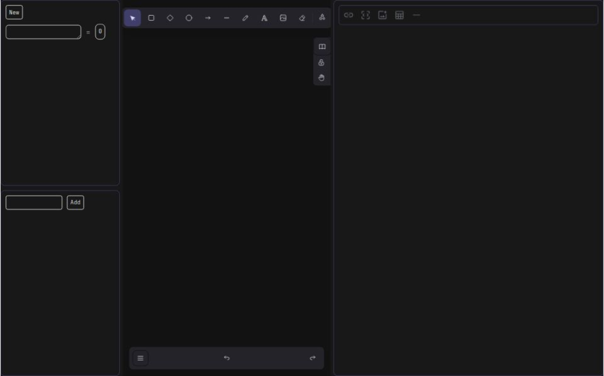

# CodeNote

CodeNote is a powerful and intuitive application designed for taking notes specifically for coding. It allows developers to jot down their thoughts, ideas, and code snippets in an organized manner.

## Screenshot



## Features


- **Built-in Calculator**: Supports multiple programming languages for enhanced readability.
- **Markdown Note Taking**: Real time note taking in markdown.
- **Feature-Rich Drawing App**: Create and organize your drawings with ease .it uses [excalidraw](https://excalidraw.com/) .
- **Built-in ToDo App**: Quickly locate notes using keywords.
- **Auto Save**: auto save in localstorage. Export your notes in various formats such as PDF, Markdown, and more.
- **easy to use split ui**: easy to use window like split ui that is resizable

## Installation

To install and run CodeNote, follow these steps:

1. Clone the repository:
    ```bash
    git clone https://github.com/hasan-bro-coder/CodeNote.git
    ```
2. Navigate to the project directory:
    ```bash
    cd codenote
    ```
3. Install dependencies:
    ```bash
    npm install
    ```
4. Start the application:
    ```bash
    npm run dev
    ```


## Contributing

We welcome contributions! Please read our [contributing guidelines](CONTRIBUTING.md) for more details.

## License

This project is licensed under the MIT License. See the [LICENSE](LICENSE) file for more information.

## Contact

For any questions or suggestions, please contact us at hasanur23910@gmail.com
